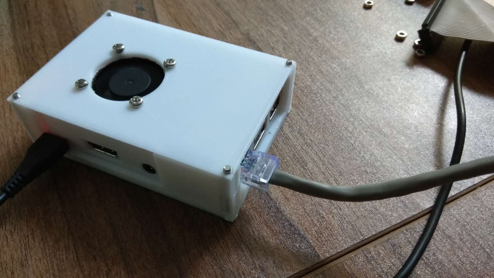

# pi-shell
一个树莓派的外壳，可直接3d打印。

效果图
===

文件说明
===

以`stl` 结尾的是模型文件，直接用切片软件打开，调整好打印的角度，送入打印机打印即可。

二次编辑
===

使用TinkCAD制作而成的，[点击这个链接](https://www.tinkercad.com/things/bsmBbjbJS3C-amazing-kieran-waasa/editv2?sharecode=pDd8wx2fJv_j4na4LXAFWvK4UpSvVY_ViIzSsJTmgYM=)  可直接在线编辑。

参数
===

###v1.0

主要参数参照Raspberry Pi官网的Raspberry Pi 3B 设计图，[这个](https://www.raspberrypi.org/documentation/hardware/raspberrypi/mechanical/rpi_MECH_3b_1p2.pdf)和[这个](https://www.raspberrypi.org/documentation/hardware/raspberrypi/mechanical/rpi_MECH_3b_1p2.dxf)。然后外扩5mm，四周固定用的螺丝是M3*30的。具体直接看模型文件。

